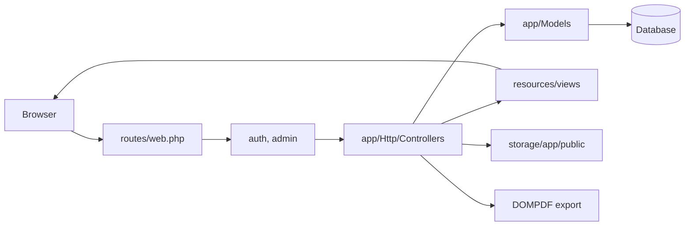
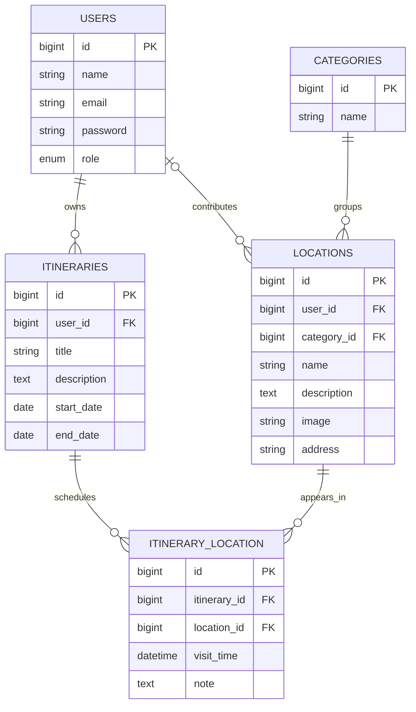

# Codebase Guide

## Architecture At A Glance

This is a server-rendered Laravel application. Browser requests enter through `routes/web.php`, pass through Laravel middleware, run controller actions, query Eloquent models, and render Blade views. Vite builds Tailwind CSS and Alpine.js assets. There is no JSON API layer.

## Repository Map

| Path | Responsibility |
| --- | --- |
| `routes/web.php` | Travel-planner routes, dashboard route, middleware grouping, and the public share route. |
| `routes/auth.php` | Laravel Breeze authentication routes. |
| `bootstrap/app.php` | Laravel bootstrapping and the `admin` middleware alias. |
| `app/Http/Controllers` | Request handling for categories, locations, itineraries, administration, and profiles. |
| `app/Http/Middleware/AdminMiddleware.php` | Rejects non-admin access to the admin route group. |
| `app/Models` | Eloquent models and relationships for users, categories, locations, and itineraries. |
| `database/migrations` | Database schema history. |
| `database/seeders/DatabaseSeeder.php` | Local demo-user seed data. |
| `resources/views` | Blade pages grouped by feature. |
| `resources/js` and `resources/css` | Vite entry points for Alpine.js and Tailwind CSS. |
| `tests` | Breeze scaffold tests plus focused travel-domain feature tests. |

## Module Map

### Authentication And Profiles

Laravel Breeze owns registration, login, logout, password reset, password confirmation, and profile editing.

- Routes: `routes/auth.php` and profile routes in `routes/web.php`
- Controllers: `app/Http/Controllers/Auth/*` and `ProfileController`
- Views: `resources/views/auth/*` and `resources/views/profile/*`
- Model: `app/Models/User.php`

Email verification routes are provided by Breeze, but the dashboard does not require verified email status because `User` does not implement `MustVerifyEmail`.

### Dashboard

The dashboard is a signed-in landing page. It reports:

- Total categories across the application.
- Total locations across the application.
- Total itineraries owned by the current user.

The database queries currently live directly in the dashboard route closure in `routes/web.php`.

### Categories

Categories organize the shared destination catalog.

- Controller: `app/Http/Controllers/CategoryController.php`
- Model: `app/Models/Category.php`
- Views: `resources/views/categories/*`
- Relationship: one category has many locations.

Read access is available to signed-in users. Category creation and deletion are admin-only. Deletion is blocked when a category still has locations, because deleting a category at the database level cascades into locations and scheduled stops.

### Locations

Locations are shared destination-catalog entries.

- Controller: `app/Http/Controllers/LocationController.php`
- Model: `app/Models/Location.php`
- Views: `resources/views/locations/*`
- Storage: uploaded images use the Laravel `public` disk under `storage/app/public/locations`.

Any signed-in user can create a location. A location stores its contributor in `user_id`. The contributor or an admin can edit or delete it. All signed-in users can browse, search, filter, and read location details.

The location-detail view embeds Google Maps by address, with the location name as a fallback query.

### Itineraries

Itineraries are user-owned trip plans.

- Controller: `app/Http/Controllers/ItineraryController.php`
- Model: `app/Models/Itinerary.php`
- Views: `resources/views/itineraries/*`
- PDF template: `resources/views/itineraries/pdf.blade.php`

An itinerary owner can create, update, delete, and view a trip; attach catalog locations; remove attached locations; and download a PDF. Controller actions enforce ownership manually.

An attached location is represented by the `itinerary_location` pivot table. Its `visit_time` and `note` are itinerary-specific.

### Public Sharing

`GET /shared/itineraries/{itinerary}` renders `resources/views/itineraries/shared.blade.php` without authentication.

This route is deliberately read-only. It currently uses a predictable database ID and has no expiry, revocation token, or privacy mode.

### Administration

Admin routes use `auth` and the custom `admin` middleware alias configured in `bootstrap/app.php`.

- Controller: `app/Http/Controllers/AdminController.php`
- Middleware: `app/Http/Middleware/AdminMiddleware.php`
- Views: `resources/views/admin/*`

Admins can view users, delete non-admin users, view itineraries, delete itineraries, and reach category write routes.

## Data Model

Important schema behavior:

- Deleting a category cascades to its locations.
- Deleting a location cascades to its scheduled-stop records.
- Deleting a user cascades to their itineraries.
- Deleting a location contributor sets `locations.user_id` to `null`.
- The pivot table does not currently enforce uniqueness, so the same location can be attached to one itinerary more than once.

## Route And Access Map

| Area | Main routes | Access |
| --- | --- | --- |
| Landing page | `GET /` | Public |
| Public itinerary share | `GET /shared/itineraries/{itinerary}` | Public, read-only |
| Dashboard | `GET /dashboard` | Signed in |
| Categories | `GET /categories`, `GET /categories/{category}` | Signed in |
| Category writes | `POST /categories`, `DELETE /categories/{category}` | Admin |
| Locations | `/locations/*` | Signed in; contributor or admin for edit and delete |
| Itineraries | `/itineraries/*` | Signed in; controller restricts records to owner |
| Itinerary stops | `POST /itineraries/{itinerary}/add-location`, `DELETE /itineraries/{itinerary}/remove-stop/{stop}` | Signed in itinerary owner |
| PDF export | `GET /itineraries/{itinerary}/pdf` | Signed in itinerary owner |
| Admin moderation | `/admin/users`, `/admin/itineraries` | Admin |

Use `php artisan route:list --except-vendor` as the source of truth when routes change.

## Request Flows

### Add A Destination

1. A signed-in user opens `/locations/create`.
2. `LocationController::create()` loads categories.
3. `LocationController::store()` validates required fields and the optional image.
4. The image is stored on the `public` disk.
5. A location record is created with the current user's ID.
6. The browser returns to `/locations`.

### Build An Itinerary

1. A signed-in user creates an itinerary at `/itineraries/create`.
2. `ItineraryController::store()` creates the itinerary through the authenticated user's relation.
3. The owner opens `/itineraries/{itinerary}`.
4. `ItineraryController::show()` loads scheduled stops and all catalog locations.
5. The owner attaches locations with an optional visit time and note.
6. The itinerary can be exported to PDF or exposed through the public read-only share URL.

### Moderate Content

1. The request enters the `auth` plus `admin` route group.
2. `AdminMiddleware` checks `Auth::user()->isAdmin()`.
3. `AdminController` lists or deletes users and itineraries.

## Frontend Notes

- Most UI text is Vietnamese and files are UTF-8 encoded.
- Blade pages use Tailwind utility classes.
- Alpine.js is initialized in `resources/js/app.js`.
- Axios is initialized in `resources/js/bootstrap.js`, but there is no custom AJAX flow yet.
- Authenticated pages load SweetAlert2 from a CDN in `resources/views/layouts/app.blade.php`.
- The welcome page and dashboard load remote Unsplash images.

## Known Gaps

Treat these as active maintenance items when touching the related modules:

1. **Group collaboration is not implemented.** Itineraries are owner-only and public sharing is read-only.
2. **Public itinerary links are enumerable.** The share route uses the itinerary database ID without a token or revocation mechanism.
3. **Authorization is still mostly manual.** Controllers enforce owner/admin checks directly. Policies would make future collaboration and moderation rules easier to test.
4. **Domain tests are partial.** Category permissions, location ownership, and exact scheduled-stop deletion have coverage. PDF export, public share access, and admin moderation still need tests.
5. **Admin moderation is basic.** Admins can list and delete users or itineraries, but there is no audit trail, soft delete, or recovery flow.

## Where To Extend

| Change | Primary files |
| --- | --- |
| Add collaboration | New membership migration and model, itinerary policies, `ItineraryController`, itinerary views |
| Add destination fields | Location migration, `Location` model, `LocationController`, location Blade views, feature tests |
| Change authorization | Prefer policies plus feature tests; keep route middleware in `routes/web.php` clear |
| Change categories | `CategoryController`, category views, routes, cascade behavior tests |
| Change itinerary exports | `ItineraryController::downloadPdf()` and `resources/views/itineraries/pdf.blade.php` |
| Add frontend assets | `resources/js`, `resources/css`, Vite build, relevant Blade layout |
