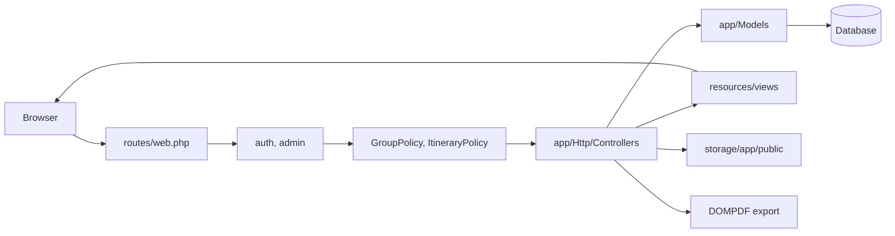
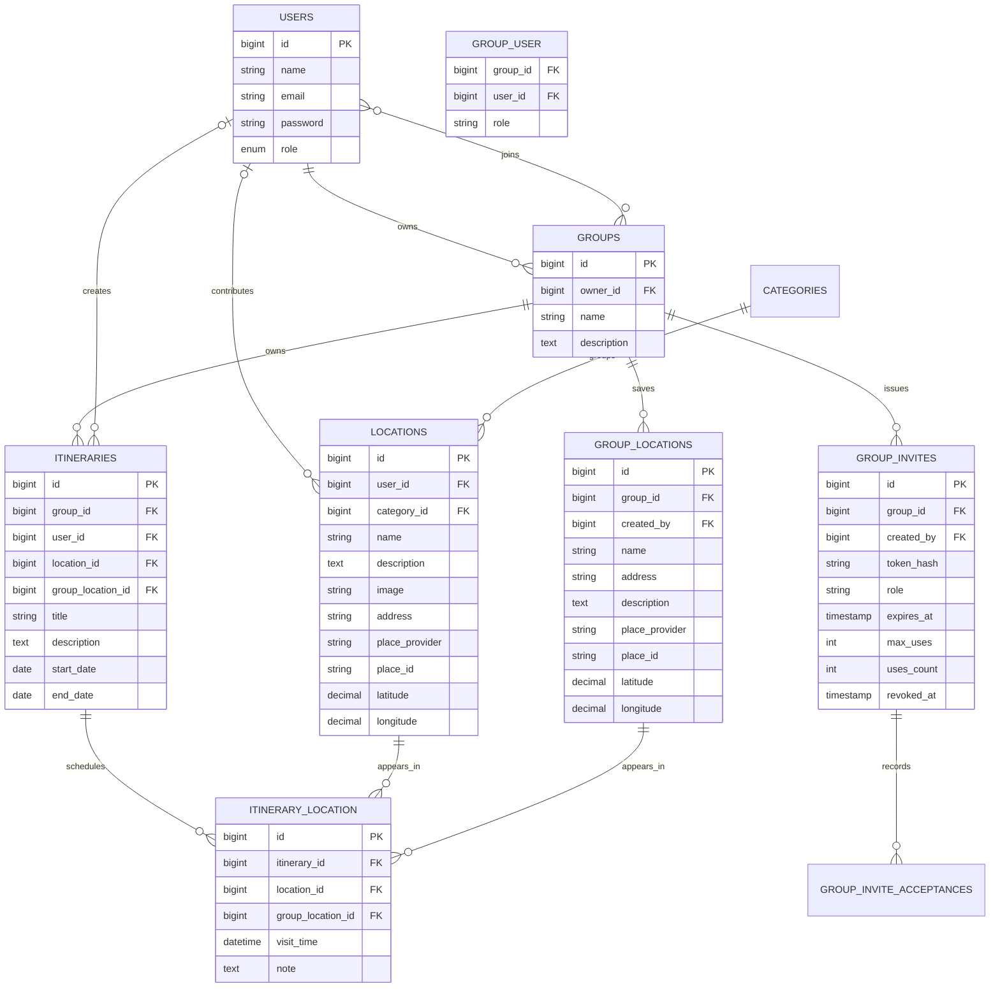

# Codebase Guide

## Architecture At A Glance

This is a server-rendered Laravel application. Browser requests enter through `routes/web.php`, pass through Laravel middleware and policies, run controller actions, query Eloquent models, and render Blade views. Vite builds Tailwind CSS and Alpine.js assets. There is no JSON API layer.

## Repository Map

| Path | Responsibility |
| --- | --- |
| `routes/web.php` | Travel-planner routes, dashboard route, group routes, invite routes, nested itinerary routes, and admin route group. |
| `routes/auth.php` | Laravel Breeze authentication routes. |
| `bootstrap/app.php` | Laravel bootstrapping and the `admin` middleware alias. |
| `app/Http/Controllers` | Request handling for categories, locations, groups, invites, itineraries, administration, and profiles. |
| `app/Policies` | Group and itinerary authorization rules. |
| `app/Models` | Eloquent models and relationships for users, groups, invites, categories, locations, group destinations, scheduled stops, and itineraries. |
| `database/migrations` | Database schema history. |
| `database/seeders/DatabaseSeeder.php` | Deterministic demo data for users, groups, memberships, categories, locations, itineraries, and scheduled stops. |
| `resources/views` | Blade pages grouped by feature. |
| `resources/js` and `resources/css` | Vite entry points for Alpine.js and Tailwind CSS. |
| `tests` | Breeze scaffold tests plus focused travel-domain feature tests. |

## Module Map

### Authentication And Profiles

Laravel Breeze owns registration, login, logout, password reset, password confirmation, and profile editing.

- Routes: `routes/auth.php` and profile routes in `routes/web.php`
- Controllers: `app/Http/Controllers/Auth/*` and `ProfileController`
- Views: `resources/views/auth/*` and `resources/views/profile/*`
- Model: `app/Models/User.php`

Email verification routes are provided by Breeze, but the dashboard does not require verified email status because `User` does not implement `MustVerifyEmail`.

### Dashboard

The dashboard is a signed-in landing page. It reports:

- Total locations across the application.
- Total groups the current user belongs to.
- Total itineraries inside those groups.

The database queries currently live directly in the dashboard route closure in `routes/web.php`.

### Categories

Categories are internal catalog metadata for grouping shared destinations without making that grouping part of the regular user-facing browse experience.

- Controller: `app/Http/Controllers/CategoryController.php`
- Model: `app/Models/Category.php`
- Views: `resources/views/admin/categories.blade.php`
- Relationship: one category has many locations.

Regular `/categories` pages redirect signed-in users back to `/locations`. Category creation, renaming, and deletion live in the dedicated admin console. Deletion is blocked when a category still has locations, because deleting a category at the database level cascades into locations and scheduled stops.

### Locations

Locations are shared destination-catalog entries.

- Controller: `app/Http/Controllers/LocationController.php`
- Model: `app/Models/Location.php`
- Views: `resources/views/locations/*`
- Storage: uploaded images use the Laravel `public` disk under `storage/app/public/locations`.

Any signed-in user can create a location. A location stores its contributor in `user_id`. The contributor or an admin can edit or delete it. All signed-in users can browse, search, and read location details.

Shared location create/edit forms use `resources/views/shared/place-picker.blade.php`. The default `MAP_PICKER_PROVIDER=osm` loads Leaflet with OpenStreetMap tiles and Nominatim search/reverse geocoding, so demos do not need a browser key. `MAP_PICKER_PROVIDER=google` switches to Google Maps JavaScript when `GOOGLE_MAPS_BROWSER_KEY` is configured.

### Groups

Groups are private trip-planning workspaces.

- Controller: `app/Http/Controllers/GroupController.php`
- Model: `app/Models/Group.php`
- Policy: `app/Policies/GroupPolicy.php`
- Views: `resources/views/groups/*`
- Membership table: `group_user`

A signed-in user can create a group and becomes its owner. Group owners can edit group details and manage invite links. Editors can mutate itineraries. Viewers can read group itineraries.

Group pages are split by task:

- Overview: `/groups/{group}`
- Private destinations: `/groups/{group}/destinations`
- Itineraries: `/groups/{group}/itineraries`
- Members and invites: `/groups/{group}/members`

### Group Destinations

Group destinations are private places saved inside one group for faster itinerary planning.

- Controller: `app/Http/Controllers/GroupLocationController.php`
- Model: `app/Models/GroupLocation.php`
- Views: `resources/views/groups/destinations/*`
- Table: `group_locations`

Owners and editors can create, update, and delete group destinations. Viewers can see them in the group destination list and itinerary selector. The create/edit form uses the same shared map picker as the global destination catalog.

### Group Invites

Group invites let authenticated users join a group through a time-limited and use-limited link.

- Controller: `app/Http/Controllers/GroupInviteController.php`
- Models: `GroupInvite`, `GroupInviteAcceptance`
- Views: `resources/views/groups/invite.blade.php`
- Routes: `GET/POST /group-invites/{token}` plus owner-managed nested invite routes under `/groups/{group}`

Invite tokens are stored as hashes. A `GET` request renders a join screen only; accepting the invite is a `POST`. An invite can expire, be revoked, or run out of uses.

### Itineraries

Itineraries are group-owned trip plans.

- Controller: `app/Http/Controllers/ItineraryController.php`
- Model: `app/Models/Itinerary.php`
- Policy: `app/Policies/ItineraryPolicy.php`
- Views: `resources/views/itineraries/*`
- PDF template: `resources/views/itineraries/pdf.blade.php`

Nested routes under `/groups/{group}/itineraries/*` ensure every itinerary is reached through a group. `itineraries.user_id` is creator attribution; it is not the access boundary. An itinerary can optionally point to one primary shared location or private group destination. Group owners and editors can create, update, delete, add stops, and remove stops. Viewers can read and download PDF exports.

An attached destination is represented by `app/Models/ScheduledStop` over the `itinerary_location` table. A stop can point to either a shared `locations.id` or a private `group_locations.id`, and the model now enforces that exactly one destination source is chosen. Its `visit_time` and `note` are itinerary-specific.

### Administration

Admin routes use `auth` and the custom `admin` middleware alias configured in `bootstrap/app.php`.

- Controller: `app/Http/Controllers/AdminController.php`
- Middleware: `app/Http/Middleware/AdminMiddleware.php`
- Views: `resources/views/admin/*`

Admins enter a separate moderation console at `/admin`. They can edit user names, emails, and roles without deleting accounts; create, rename, and safely delete unused categories; and list/delete itineraries. Admins are not group owners by default.

## Data Model

Important schema behavior:

- Deleting a group cascades to its memberships, invites, itineraries, and scheduled stops.
- Deleting a group destination cascades to scheduled stops that use that private destination.
- Deleting an itinerary cascades to its scheduled-stop records.
- Deleting a category cascades to its locations.
- Deleting a location cascades to its scheduled-stop records.
- Deleting a location contributor sets `locations.user_id` to `null`.
- Deleting an itinerary creator sets `itineraries.user_id` to `null`.
- Deleting an itinerary primary destination sets the relevant itinerary destination foreign key to `null`.
- The pivot table does not currently enforce itinerary/location uniqueness, so the same location can be attached to one itinerary more than once.

## Route And Access Map

| Area | Main routes | Access |
| --- | --- | --- |
| Landing page | `GET /` | Public |
| Dashboard | `GET /dashboard` | Signed in |
| Categories | `GET /categories`, `GET /categories/{category}` | Signed in; redirects to locations |
| Category management | `/admin/categories/*` | Admin; create, rename, and delete unused categories |
| Locations | `/locations/*` | Signed in; contributor or admin for edit and delete |
| Groups | `/groups/*` | Signed-in group members; owner for update/delete |
| Group destinations | `/groups/{group}/destinations/*` | Group member view; owner/editor mutate |
| Group invites | `/groups/{group}/invites`, `/group-invites/{token}` | Group owner creates/revokes; authenticated users accept valid invites |
| Itineraries | `/groups/{group}/itineraries/*` | Group member view; owner/editor mutate |
| Itinerary stops | `POST /groups/{group}/itineraries/{itinerary}/add-location`, `DELETE /groups/{group}/itineraries/{itinerary}/remove-stop/{stop}` | Group owner/editor |
| PDF export | `GET /groups/{group}/itineraries/{itinerary}/pdf` | Group member |
| Admin moderation | `/admin`, `/admin/users`, `/admin/categories`, `/admin/itineraries` | Admin |

Use `php artisan route:list --except-vendor` as the source of truth when routes change.

## Request Flows

### Create A Group

1. A signed-in user opens `/groups/create`.
2. `GroupController::store()` validates the group name and optional description.
3. The group is created with the current user as owner.
4. The current user is attached as an owner membership.
5. The browser redirects to the group workspace.

### Invite A Member

1. A group owner opens a group workspace.
2. `GroupInviteController::store()` creates a hashed invite token with selected role, expiry, and max-use count.
3. The raw invite URL is shown once through flash session data.
4. The invited signed-in user opens `/group-invites/{token}`.
5. The join screen displays invite status.
6. The user accepts with `POST /group-invites/{token}`.
7. The app records membership, increments invite usage, stores an acceptance record, and redirects to the group.

### Build A Group Itinerary

1. A group owner or editor opens `/groups/{group}`.
2. They optionally create private group destinations under `/groups/{group}/destinations/create`.
3. `ItineraryController::store()` creates the itinerary through the group relation, optionally stores a primary destination, and stores the current user as creator.
4. The group member opens `/groups/{group}/itineraries/{itinerary}`.
5. Owners and editors add stops from `/groups/{group}/itineraries/{itinerary}/stops/create`.
6. Stops can reference either a private group destination or a shared catalog location.
7. Any group member can export a PDF.

### Moderate Content

1. The request enters the `auth` plus `admin` route group.
2. `AdminMiddleware` checks `Auth::user()->isAdmin()`.
3. `AdminController` renders the admin console, updates user information, and moderates itineraries; `CategoryController` handles the dedicated admin category screen.

## Frontend Notes

- Most UI text is Vietnamese and files are UTF-8 encoded.
- Blade pages use Tailwind utility classes.
- Alpine.js is initialized in `resources/js/app.js`.
- Axios is initialized in `resources/js/bootstrap.js`, but there is no custom AJAX flow yet.
- Authenticated user pages use a sidebar in `resources/views/layouts/navigation.blade.php`.
- Admin pages use a separate dark console layout in `resources/views/layouts/admin.blade.php`.
- Authenticated user pages load SweetAlert2 from a CDN in `resources/views/layouts/app.blade.php`.
- The welcome page and dashboard load remote Unsplash images.

## Known Gaps

Treat these as active maintenance items when touching the related modules:

1. **Map selection is provider-dependent.** The default `osm` provider is suitable for low-volume demos without keys. Google Maps remains available only when a browser key is configured and the local origin is allowed.
2. **Invitation lifecycle is basic.** Invite links can expire, run out of uses, or be revoked, but there is no email delivery, notification, or member removal UI yet.
3. **Authorization is policy-backed for groups and itineraries but still manual elsewhere.** Location and admin flows still enforce access mostly in controllers.
4. **Domain tests are partial.** Group access, invites, private destinations, category permissions, admin user editing, location ownership, and exact scheduled-stop deletion have coverage. PDF export and admin moderation still need tests.
5. **Admin moderation is basic.** Admins can edit users, manage categories, and remove itineraries, but there is no audit trail, soft delete, or recovery flow.

## Where To Extend

| Change | Primary files |
| --- | --- |
| Change private group destinations | `GroupLocationController`, `GroupLocation`, `ScheduledStop`, group destination views, feature tests |
| Change group roles | `Group`, `GroupPolicy`, `ItineraryPolicy`, group views, invite validation, feature tests |
| Change invite behavior | `GroupInviteController`, `GroupInvite`, invite migrations/views, feature tests |
| Add destination fields | Location migration, `Location` model, `LocationController`, location Blade views, feature tests |
| Change authorization | Prefer policies plus feature tests; keep route middleware in `routes/web.php` clear |
| Change categories | `CategoryController`, admin category view, redirect behavior, cascade behavior tests |
| Change itinerary exports | `ItineraryController::downloadPdf()` and `resources/views/itineraries/pdf.blade.php` |
| Add frontend assets | `resources/js`, `resources/css`, Vite build, relevant Blade layout |
